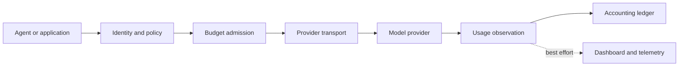

# Every model call, accounted for

Sandhi routes AI requests, applies access policy and measures usage in **neutral
units**. Use the standalone gateway for enforcement or the library for metering.
Pricing and billing belong to downstream systems.

- **Connect with identity**

    Use OIDC for standalone access. Keep provider credentials at the gateway.

    [Configure SSO →](operator/oidc-sso.md)

- **Control access and capacity**

    Bind identities to models, budgets and operator-owned deadlines.

    [Understand budgets →](product/metering-and-budget-guarantees.md)

- **Recover without replay**

    Separate observed usage from persisted evidence and committed accounting.

    [Explore tracked accounting →](operator/buffered-accounting.md)

## One request, two responsibilities

| Responsibility | Standalone gateway | In-process library |
|---|---|---|
| Normalize and attribute usage | Yes | Yes |
| Keep upstream credentials behind a boundary | Yes | Caller owns credential handling |
| Enforce proxy budgets and admission | Yes, single node | No proxy ledger enforcement |
| Price usage or bill customers | Downstream responsibility | Downstream responsibility |

## Recent source changes and their limits

!!! warning "Develop is ahead of the serving release"
    Tracked buffered accounting is opt-in in the [published 0.12.0 release](releases/v0.12.0.md).
    Passing source tests do not establish a released deployment or full mixed-team
    acceptance. Check [release artifacts](https://github.com/anvai-labs/sandhi/releases)
    and your actual binary identity before enabling it.

| Change | What it gives you | Still to qualify |
|---|---|---|
| Owned buffered admission and recovery ([#338](https://github.com/anvai-labs/sandhi/pull/338)) | Correlated intent, retained final usage and bounded recovery | Broader lifecycle and release/deployment |
| Actual process restart drills ([#339](https://github.com/anvai-labs/sandhi/pull/339)) | Held unknown liability; one recovered receipt without another model call | Live provider/member acceptance |
| Terminal publication under contention ([#340](https://github.com/anvai-labs/sandhi/pull/340)) | Recovery if RAM survives; explicit uncertainty if it does not | Tracked TLS/OIDC and streaming lifecycle |

[Accounting contract and evidence](product/attempt-accounting-and-evidence.md)
contains the complete status. [The documentation map](README.md) separates current
contracts, design history and co-design snapshots.

## Choose your next step

| Your task | Guide |
|---|---|
| Let people sign in and assign roles | [OIDC setup](operator/oidc-sso.md) · [groups and delegated keys](operator/identity-groups.md) |
| Set global, endpoint or model deadlines | [Buffered calls](operator/buffered-deadlines.md) · [streaming](operator/streaming-deadlines.md) |
| Understand cache counts and missing measurements | [Cache reporting](adr/0010-cache-read-reporting-availability.md) |
| Rehearse restart and restore safely | [Recovery drill](operator/recovery-drill.md) |
| Integrate embeddings or completions | [Text endpoints](operator/text-endpoints.md) |
| Inspect architecture, decisions and unfinished work | [Documentation map](README.md) |
