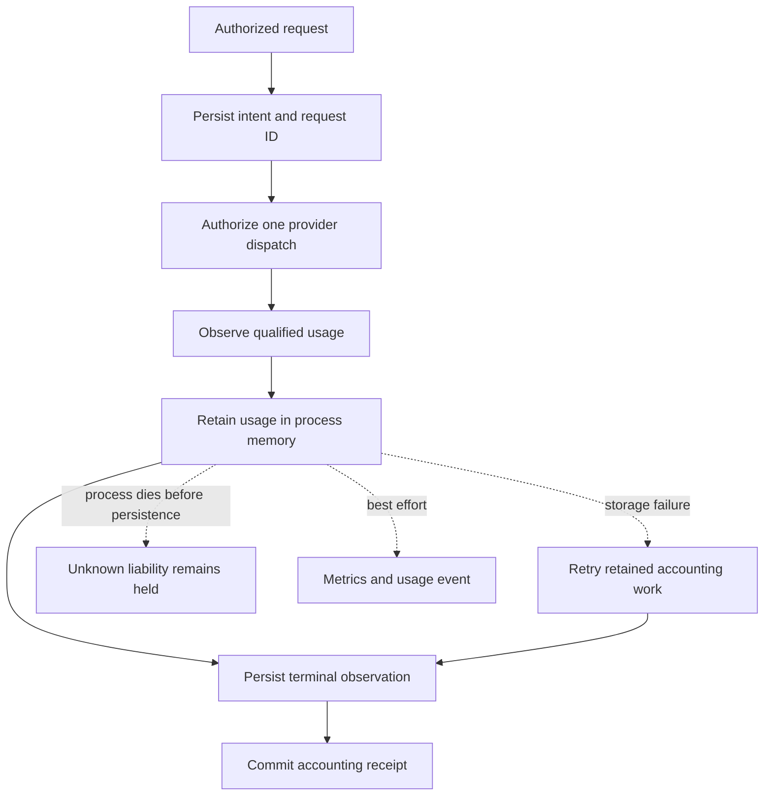

# Owned HTTP accounting

!!! warning "Opt-in accounting; lifecycle acceptance remains separate"
    `SANDHI_BUFFERED_ACCOUNTING=tracked` enables durable buffered HTTP accounting.
    It is included in the [0.12.0 release scope](../releases/v0.12.0.md); check that
    page for publication status. A package release does not establish deployment
    acceptance. Unset or `off` preserves the existing path. Any
    other value fails startup.

The development source also admits **transparent OpenAI Chat streaming** when
tracked accounting and a complete [streaming deadline policy](streaming-deadlines.md)
are both configured. This extension is not in 0.12.0 and is not deployment acceptance.
Streaming without that policy remains refused before admission.

Keep the existing authentication, TLS, credential and `SANDHI_STORE` configuration.
This switch grants no permissions and changes no provider credentials.

## Follow the evidence

| Evidence | What it proves | What it does not prove |
|---|---|---|
| Request ID and prepared intent | One correlated admission is durable | The provider executed or charged |
| Usage in memory or metrics | The gateway observed reported usage | Persistence or committed spend |
| Durable terminal observation | The original usage snapshot survived storage | Settlement has committed |
| Accounting receipt | The original ledger committed accounting | Atomic telemetry delivery or external billing |

A disconnected client does not cancel owned admission or buffered execution.
For tracked streams it closes the source while retaining its last observed usage
for settlement. Recovery never repeats inference or re-emits usage events.
Usage is retained before telemetry callbacks; a failing sink cannot discard the
snapshot needed for accounting recovery.

## Supported activation

| Surface | Required in tracked mode | Refused before admission |
|---|---|---|
| Ledger | One file-backed ledger, fixed topology | Volatile or sharded ledgers fail startup |
| Ingress | Buffered OpenAI Chat or Anthropic Messages; bounded transparent OpenAI Chat streaming | Other dialects; translated or unbounded streaming |
| Upstream | Built-in, retry-free OpenAI-compatible transport | Custom transports; expiring credential handles without raw transport |
| Policy | Explicit output limit and Block policy | Warn, fail-open, retry and logical-idempotency combinations |
| Processing plane | Buffered transparent/translated; streaming transparent only | No silent downgrade to legacy accounting |

## Bounds and configuration

| Bound | Standalone value | Configuration / meaning |
|---|---|---|
| Retained owners | 64 | One slot spans the detached HTTP operation |
| Each accounting wait | 2 seconds | A timed-out wait does not cancel or repeat a possibly committed transition |
| Transport deadline | 120 seconds | Existing global/endpoint/model buffered policy may override, up to 600 seconds |
| HTTP wait | Transport + three accounting waits | A longer client timeout cannot extend it |
| Retained intent capacity | 100,000 | Retention and migration are separate work |

Embedders can call `settlement::buffered::enable(&Arc<ProxyState>, Config::new(...))`
before serving. Configuration is immutable after enable. The library validates
capacity 1–1024, accounting waits up to 30 seconds and transport deadlines up to
600 seconds. See [buffered deadline policy](buffered-deadlines.md).

Tracked streams use the authorized endpoint/model's setup, idle and body limits.
Admission reserves setup + body duration plus three accounting waits and 60 seconds
of headroom. The existing post-header lease check still applies. On shutdown,
tracked delivery stops one accounting wait before the original grace deadline
(or immediately if less time remains); the deadline is never extended. This gives
settlement an opportunity, not a guarantee against SQLite contention.

## Interpret a response

| Outcome | Client result | Required interpretation |
|---|---|---|
| Final qualified usage and committed settlement | Normal provider result | Consult the receipt for committed accounting |
| Missing/malformed usage, transport failure, accounting timeout or failed settlement | Correlated 502 | Upstream may have completed; **do not automatically retry** |
| Explicit reported zero | May settle zero | Absence of usage is not reported zero |
| Client disconnect | Client has no confirmed result | Gateway ownership continues; inspect evidence |

The client may not receive completed model output when accounting is unresolved.
A 502 is not proof the model failed.

For streams, headers and partial bytes can already have reached the client.
A successful HTTP EOF waits for committed settlement; unresolved accounting ends
the body with an error. Already-forwarded `[DONE]` is **not** an accounting receipt.
Clients that stop reading at `[DONE]` must consult durable evidence independently.
No retry is authorized by an interrupted response.

| Stream evidence at source termination | Stored usage | Settlement |
|---|---|---|
| Qualified counts; cancellation/timeout but no qualification error | Final counts and delivery outcome | May commit the measured charge |
| Conflicting/malformed data, truncated event or missing terminator at EOF | First counts retained as Partial with bounded qualification reason | Unresolved; no receipt |
| No qualified counts | Unavailable with explicit missing-usage reason | Unresolved; never an invented zero |
| Terminal publication refused or unavailable | Immutable snapshot retained in the existing jobs owner | Retry accounting only; death before persistence leaves unknown liability |

Partial observed totals agree between metrics, events and stored evidence; observed
totals are not committed spend. No second parser or settlement eligibility rule is
introduced. Qualification remains conservative when later data invalidates a stream.

Each admitted request gets one generated Sandhi ID, committed atomically with its
prepared intent. Responses carry `x-sandhi-request-id`; tracked usage events use
that same ID and preserve an available origin ID separately. The ID is not an
execution ID, idempotency key or replay authority. Old admissions retain absent
correlation. Response-body completion IDs are not substituted for HTTP request IDs.
The typed provider response currently does not preserve success response headers;
an absent origin ID does not invalidate the gateway/intent/receipt join.

## Recover and shut down

| Situation | Behavior |
|---|---|
| Process survives a storage failure | Retry the retained, immutable terminal snapshot |
| Durable final usage survives a restart | Recover settlement through the original ledger |
| Process dies before terminal persistence | Keep liability unresolved; RAM cannot establish durable evidence |
| Recovery sweep | Once per second; at most eight batches, 32 execution records and one retained terminal retry per batch |
| Sweep progress | Advance scope/execution cursors, including unbudgeted and removed-key scopes |
| Shutdown | Drain workers, then check fresh bounded durable inventory plus retained owners |
| Unknown rows, incomplete inventory or timeout | Incomplete shutdown, exit 124 |

The one-second recovery check happens between batches. These are iteration/record
bounds, **not a hard SQLite latency bound**. Recovery settles only authoritative
final usage; unavailable observations stay held. Shutdown keeps the original grace
deadline and watchdog; a large backlog may need more recovery before shutdown.
Do not restore older writers over a database containing tracked evidence.

## Accepted source evidence and remaining gates

| Gate | Source evidence | Scope |
|---|---|---|
| Unknown dispatch after SIGKILL | Liability and incomplete shutdown survive restart | [#339](https://github.com/anvai-labs/sandhi/pull/339) |
| Persisted final usage | One receipt recovered; another restart preserves spend and identity | #339, synthetic receipt-write failure |
| Terminal publication contention | Retained retry commits once if process survives; death preserves unknown liability | [#340](https://github.com/anvai-labs/sandhi/pull/340) |
| Tracked buffered TLS/OIDC | CA-verified shutdown and OIDC accounting/denial joins; existing browser role matrix | [Synthetic source acceptance](../product/attempt-accounting-and-evidence.md#tracked-buffered-tlsoidc-source-acceptance) |
| OIDC crash/restart | Unknown liability retains its bound scope; final usage settles once after inference-grant revocation; new dispatch is denied without accounting changes | Same two recovery cases parameterized over token and TLS/OIDC modes |
| Released binary with deployed OIDC policy | 0.12.0 isolated TLS candidate: both Qwen routes and ZAI reconcile three receipts / 51 tokens | [Qualification and limits](../product/attempt-accounting-and-evidence.md#isolated-released-binary-oidc-qualification-2026-10-10); managed gateway unchanged |
| Managed tracked OIDC and streaming lifecycle | Pending | Source HTTP tests do not qualify deployed lifecycle |
| Strict streamed usage qualification | Core qualifier, bounded event observer and opt-in raw response owner; usage survives drop/error; no automatic replay | [Source prerequisite](../product/attempt-accounting-and-evidence.md#openai-chat-stream-usage-qualification-w05c-prerequisite); Rust raw transport plus opt-in tracked HTTP bridge; unreleased |
| Tracked streaming HTTP ownership | Source tests | Clean EOF after receipt, bounded disconnect/deadline/shutdown, partial/absent usage, setup timeout, failed terminal write and accounting-only retry, panicking telemetry |
| Standalone streaming lifecycle | Built-proxy HTTP/TLS and OIDC fixtures | [Process death/restart, contention, revoked-grant recovery and completion/disconnect/SIGTERM](../product/attempt-accounting-and-evidence.md#standalone-streaming-lifecycle-source-acceptance); synthetic source evidence, unreleased |
| Executed cache reuse, tokenizer correctness and actual-member C5 | Pending | Source drills cannot establish these |
| Released tracked-mode deployment | Pending | Existing 0.12.0 default-mode deployment does not qualify tracked lifecycle |

The restart drills use the same copied/hashed binary and local synthetic provider
responses. The existing SIGKILL and terminal-publication contention drills run with
buffered and streaming requests in token compatibility and CA-verified TLS/OIDC
modes using the disposable authority. Each drill observes one origin request.
See the [full acceptance record](../product/attempt-accounting-and-evidence.md#tracked-buffered-crashrestart-acceptance).

!!! note "Telemetry is not a settlement outbox"
    Events, metrics and traces are best effort. Counters can increase before
    persistence, and a success-labelled observation does not prove a successful
    client response. The event may be absent after a sink failure. Tracked threshold
    alerts, atomic telemetry export, observation amendments and multi-shard migration
    remain separate work.
