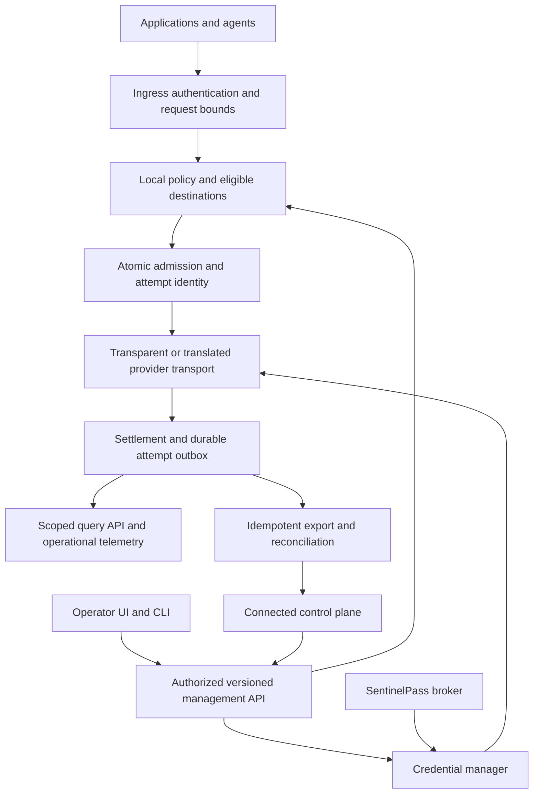

# Sandhi: trusted AI access and accountable usage

Status: Proposed product direction, 2026-09-04. Nothing in this document is a shipped-feature claim.
Execution: [TD-0026](../td/TD-0026-gateway-product-evolution.md).
Evidence: [implementation review](../reviews/gateway-review-2026-09-04.md).

## Vision, worked backward

A team can connect its applications and agents to approved models, give each caller appropriate
access, bound consumption, and explain every material decision and measurement. The operator can
answer: who called which service, why the gateway allowed it, what happened upstream, how much
was measured, what remains uncertain, and what action will restore service.

Proposed product promise: **Connect once. Control access. Account for every attempt.**

Sandhi supplies the enforceable gateway and neutral measurement mechanisms. SentinelPass supplies
credential custody and scoped secret access. A connected control plane supplies identity lifecycle,
commercial pricing, monetary policy and fleet administration. A self-hosted installation remains
useful with local management and usage budgets when no commercial control plane is connected.

Primary initial users are application developers, team operators and platform/on-call engineers.
Security reviewers and finance owners need trustworthy evidence from the same system, filtered to
their authority. This self-hosted-first priority is a planning assumption awaiting product feedback.

### Future launch scenario

A team operator registers a provider credential reference, sees that the broker grant is healthy,
selects the permitted models, and creates an application key with usage limits. The developer
copies an SDK example and sends a request. Its trace and usage appear with attribution and data
freshness. Later, an agent exhausts its run allowance: the developer receives an actionable denial,
the operator sees the limiting scope and active reservations, and finance sees downstream cost
estimates with their price version and reconciliation state. During key rotation, new calls move
to the verified credential generation and the UI identifies any consumers that have not switched.

### First principles

1. Every production claim needs a defined failure behavior and observable evidence.
2. Authority comes from verified credentials and policy, never caller-provided labels.
3. Admission reserves capacity before spending; measurement records reality even when estimates fail.
4. A logical request, a physical provider attempt and a billing adjustment are different facts.
5. Missing data is unknown. Failed writes are failures. A stale view must say when it was current.
6. Secrets, content, identities and aggregate usage have separate access and retention boundaries.
7. A feature earns its latency, operational cost and scope through a named user outcome.

## User journeys and co-design checks

| Journey | User-visible sequence | Failure/recovery design | Proposed acceptance |
|---|---|---|---|
| J01: first useful request | Pick deployment posture → reference credential → check connection → choose models → mint scoped key → copy SDK sample → see attributed call | Locked broker and missing grant are distinct; provider check declares if it invokes a billable request; masked secrets and one-time key display | A new developer completes the scripted task in under 10 minutes using a mock provider; validate with five representative users before treating the target as achieved |
| J02: understand a denial | Request ID → safe reason → limiting scope/reset or access remedy | Differentiate exhausted budget, rate limiting, disallowed model, unavailable authority and provider failure; respect SDK error envelopes | Caller can find the next action without seeing another tenant's policy or activity |
| J03: manage a budget | Choose scope/windows → preview effective policy and current commitments → apply → observe committed revision | Show measured, reserved and uncertain amounts; invalid policy rejected; persistence failure preserves prior revision | UI/API/CLI agree after restart; concurrency and rollover tests prove the advertised guarantee |
| J04: investigate an incident | Operations view → provider/route signal → request/attempt timeline → policy and credential revision → runbook | Loading, stale, degraded and empty are separate states; exact IDs live in traces, not metric labels | Operator identifies a seeded auth, capacity, upstream or export incident within five minutes in a drill |
| J05: rotate or revoke | View affected consumers → stage replacement → check → activate generation → drain old generation → confirm | Show difference between a broker grant, a virtual key and the provider credential; explicit handling of active streams and rollback | No new dispatch on an expired/revoked generation after the configured bound; unrelated credentials stay usable |
| J06: reconcile consumption | Time/project/model/run filters → logical calls and physical attempts → export status → downstream estimate/reconciliation | Unknown token categories and price gaps remain visible; cached-provider units stay distinct | Attempt totals reconcile to enforcement and export within a declared freshness bound; billing adjustments are attributable |

Co-design method for each journey: review a concrete normal flow and two failure flows with the
developer/operator/security/finance roles; review the API/CLI and data contract with implementers;
record disagreements, alternatives, the chosen tradeoff, and executable acceptance. These are planned
reviews, not completed stakeholder sign-offs. Use mockups and synthetic data before real credentials.

## Experience design

Navigation: Overview, Requests, Usage & budgets, Access, Providers & credentials, Policies,
Operations, Audit. The initial implementation can retain a small server-served UI; a framework
migration is not a prerequisite. Extract static assets from the proxy module when adding browser
tests and CSP, so UI changes do not require editing admission logic.

Overview answers health, consumption, active alerts and data freshness. Requests provides a bounded,
paginated metadata timeline with request, attempt, run and upstream correlation. Usage & budgets
shows UTC window boundaries, display timezone, measured/reserved/uncertain quantities and budget
guarantee. Provider details show credential generation, grant status, capability restrictions and
last successful check. Policies preview effective decisions and revisions before apply.

Use consistent loading, empty, forbidden, unavailable, stale and partial states across panels.
Require keyboard operation, meaningful field labels, focus management, accessible status messages,
adequate contrast and small-screen layouts. Secret actions need clear scope and a recoverable
workflow where possible. Avoid exposing architectural jargon in the normal onboarding flow.

## Requirements and acceptance contracts

| ID | Requirement | Acceptance contract | Finding / owner |
|---|---|---|---|
| R01 | Authenticated, truthful operator experience | Authenticated browser reads and mutations work together; failed reads never display zero totals; keyboard journey tests pass | F01/F06/F07; proxy/UI |
| R02 | Committed management operations | Schema validation, revision conflict handling and durable commit precede success; partial config apply has explicit per-item results until transactional apply exists | F02/F16; operator/store |
| R03 | Trustworthy accounting | Explicit reasoning inclusion; measured/estimated and final/partial/unavailable retained; logical and physical attempt views reconcile | F03/F04/F05; core/providers/store |
| R04 | Hierarchical consumption controls | Atomically reserve every applicable scope/window; define RPM/TPM/concurrency, warning versus blocking, reset and outage behavior | F10; TD-0005/0007 |
| R05 | Complete operational evidence | Request decisions, terminal attempts, export backlog and control revisions are queryable with retention and access checks | F06/F11/F12; proxy/store |
| R06 | Least-privilege management | Scoped local service credentials; downstream identity mapped to verified principals; tenant filtering at store query boundaries; audit every mutation | F11; proxy/control plane |
| R07 | Broker-aware credential lifecycle | Native async-safe IPC, exact credential references, generation/expiry, rotation and invalidation; broker grant and provider revoke distinguished | F08/F09; Sandhi/SentinelPass |
| R08 | Safe policy evolution | Pure deterministic evaluation, explicit allow/deny effects, exact matching, shadow mode, revision/freshness and rollback protection | F16; TD-0005 |
| R09 | Explainable reliable routing | Eligible destination filtering precedes route choice; capability/residency restrictions and session affinity survive fallback; no retry after delivered bytes | F14; providers/proxy |
| R10 | Privacy and egress controls | Content capture off by default; scoped retention/redaction, content-access audit, bounded hooks; approved destinations and explicit local exceptions | F07/F15; proxy/security |
| R11 | Monetary-budget integration | Neutral evidence exported with immutable IDs and category provenance; downstream price version, currency, estimate and invoice state are distinct | F03/F05/F06; control plane integration |
| R12 | Operable deployment | Drain readiness, capacity metrics, bounded storage, restore drill, config rollback, safe upgrade and declared single-node/fleet guarantee | F12/F13; TD-0014/0015/0016/0017/0020/0024 |
| R13 | Stable ecosystem contracts | Rust-authoritative schemas, compatibility handshakes, Python/Node generation and real SDK conformance; optional broker dependency remains optional | F08/F16; core/bindings/protocol |

Targets are proposals, not measurements: zero unauthorized cross-scope reads in the security corpus;
zero acknowledged-but-uncommitted management writes under injected failure; all admitted attempts
durably recoverable in authoritative accounting mode; fresh local usage within five seconds at the
published reference load. Establish p50/p95/p99 gateway overhead, TTFT overhead, concurrency, memory,
FD, database-size and export-lag baselines before setting performance SLOs. A suggested initial
regression threshold is 10% p95 overhead on the same hardware/workload, reviewed against variance.
Provider time is excluded from gateway-overhead comparisons and reported separately.

## Target architecture

This management/data separation is distinct from the existing transparent/translation forwarding
planes. Preserve the latter's byte fidelity and attribution-outside-prompt invariant.

| Component | Responsibility and implementation seam |
|---|---|
| `sandhi-core` | Transport-free policy facts/decisions, usage semantics, attempt and audit boundary types, admission contracts; explicit clock inputs for deterministic policy/window tests |
| `sandhi-providers` | Family codecs, provider measurement normalization, transport facts, attempt hooks, bounded retries and credential-specific clients; preserve public Rust compatibility |
| `sandhi-store` | SQLite durable state, attempt outbox, scoped query/retention, mutation audit and atomic commit interfaces; shared backend behind the same conformance suite |
| `sandhi-proxy` | Authentication/authorization, ordered admission stages, credential manager, lifecycle/readiness, protected management API and static UI; no pricing tables |
| SentinelPass | Encrypted secret custody, exact grants and token lifecycle, approved metadata/rotation contracts; no AI prompt or metering dependency in its security core |
| Connected control plane | Enterprise identity and fleet policy authorship; price schedules, monetary budgets, financial reconciliation and commercial dashboards |

### Admission and accounting invariants

Authenticate → validate attribution and bounded ingress → evaluate policy and eligible routes →
check rate/concurrency → reserve applicable usage budgets → dispatch an identified physical attempt
→ finalize measured/partial/unknown usage → settle and enqueue authoritative evidence → export.
Resolve usable credential generations before dispatch; an unavailable or expired one prevents new
dispatch under the configured policy. Every early denial has a safe decision record, but no
fabricated provider-usage event. Any acquired reservations/permits are released on pre-dispatch failure.

Keep logical `UsageEvent` consumers compatible. Introduce a separately versioned attempt record
with tenant/project identity, logical request ID, attempt ID, upstream ID, selected destination,
policy/credential revisions, usage certainty and terminal outcome. An attempt count is useful
summary data but cannot replace the individual records. Deduplicate export by immutable attempt ID;
never deduplicate two physically billable attempts merely because their logical idempotency key matches.

Settlement and the authoritative outbox should commit in one transaction. Current usage, ledger
shards and observer buffers do not provide that guarantee: co-locate each attempt outbox with its
owning ledger transaction and aggregate asynchronously. For multi-scope reservations across shards,
select a backend that can commit all participating scopes atomically or redesign placement first;
sequential per-shard reservations are insufficient. Evaluate PostgreSQL transactions and Redis
atomic operations (including cluster-slot placement, persistence and failover limits) under TD-0007.

Recover abandoned attempts as unknown liabilities pending reconciliation, not automatically proven
zero spend. TTL reclaim, late settlement, outbox replay and rollup tombstones need one state machine.
Strict admission requires bounds for all counted categories and aggregate in-flight work. If a
provider cannot supply a safe bound, label admission estimated or refuse it under a strict policy.

### Usage budgets and money

Neutral tokens count categories at unit weight; their sum is not a monetary estimate. Currency
calculation must preserve input, output, cache creation/read, reasoning inclusion, service facts
and price effective time. Unknown prices or usage are unknown, not free. Route optimization must
not silently substitute a lower-quality model or change residency to save money.

Stage monetary integration in two deliveries. First, export durable attempt facts to downstream
pricing and show linked estimate/reconciliation state there. Second, if monetary admission is
required, a downstream authority reserves currency against a versioned quote and issues an opaque,
scoped, expiring grant with enforceable usage/destination bounds. Sandhi dispatches only after that
grant and its own neutral reservation exist. A durable compensation/recovery workflow releases
unused reservations; absence of a cross-system transaction must be explicit. Retries need their
own coverage. An asynchronous threshold notification is not a strict monetary admission grant.

Do not guarantee a final provider invoice cap: provider-side delayed charges, unknown attempts,
unsupported billing dimensions and reconciliation can differ from admission estimates. Product
language must distinguish the exact admission guarantee from estimated or reconciled money.

### Security and lifecycle boundaries

Local roles begin with reader, operator and administrator capabilities, expressed as scoped
permissions rather than role-name checks scattered through handlers. Identity provisioning,
SSO and organization lifecycle remain downstream. Browser sessions need a design before replacing
bearers with cookies; cookies introduce CSRF and session-expiry requirements. Until then minimize
token retention and eliminate unsafe DOM construction.

Use one tested egress policy for providers, webhooks and remote policy/guardrail services: schemes,
hosts, redirects and resolved addresses must respect explicit deployment rules, including approved
local inference endpoints. Apply authorization before accepting caller-selected routing overrides.
Never forward authorization to an unapproved redirected origin.

Content inspection is opt-in. A mandatory pre-output guardrail must buffer within strict bounds or
use an upstream control; it cannot promise to retract tokens already delivered to a caller. A
best-effort stream detector must be labeled accordingly. Record classifier/policy version, timeout
behavior and false-positive evaluation. Secret detection must never export a vault's secret values,
equality tags or reuse graph into the gateway.

### Policy and contract migration

Reconcile TD-0005 before coding: explicit `Allow`/`Deny`, exact versus prefix matching, authoritative
attribution, shadow versus enforce and atomic admission. Signed bundles need issuer/audience,
issued/expiry times, persisted monotonic revision floor and signer custody separate from admin
access. In-process evaluation remains advisory when the caller can bypass it.

New public records originate in Rust and regenerate schemas and binding facades. Additive fields
must preserve old readers; changes to reasoning accounting or historical interpretation require a
documented migration/version strategy. Do not silently rewrite historical measurements or money.
Use expand/backfill/validate/switch/contract migrations with tested backup/restore; data migration
rollback must not erase valid post-migration usage.

## Explicitly deferred scope

Browser execution remains AgentBrowser's responsibility, with shared journeys and boundary
contracts in the [browser–gateway–vault co-design](../upstream/browser-gateway-vault-codesign.md).
Its synthetic dashboard smoke is verified; live broker resolution and shared action evidence are
proposals. Model-call budgets do not authorize browser side effects or vault access.

Embeddings remain subject to ADR-0007; duplex/WebSocket to TD-0018; HTTP/2 to ADR-0009/TD-0017.
MCP/A2A proxying, semantic caching, prompt management, semantic routing, provider-signing breadth
and hosted billing require named demand, safe accounting/authorization semantics and benchmarks.
For each, document a user journey, protocol/content boundary, failure behavior and measurable win
before scheduling implementation. Passing through tool-call JSON is not tool execution governance.
