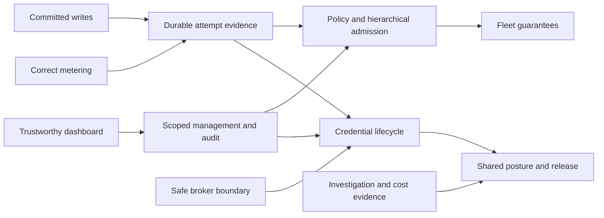

# TD-0026: Gateway product evolution and delivery plan

Status: In progress — review and planning complete; M1 implementation underway.
Date: 2026-09-04
Baseline: `ed1781e` (Sandhi); source review, not a release certification.

## Mandate

Work backward from a coherent product vision to user journeys, requirements, architecture,
contracts, implementation slices, and executable acceptance gates. Cover developer and operator
UX, operational tracking, security, usage and cost controls, reliability, and ecosystem integration.
Co-design credential lifecycle and shared capabilities with SentinelPass and AgentBrowser. Keep proposed behavior
distinct from shipped behavior and preserve ownership of existing ADRs and TDs.

This is the persistent activity tracker. Product implementation was authorized on 2026-09-04;
marking a planning task complete does not mark its implementation complete.

## Activity tracker

| ID | Activity | State | Evidence / next action |
|---|---|---|---|
| A01 | Inventory vision, designs, contracts, implementation, and tests | Complete | Evidence register F01–F16 links findings to source, impact and acceptance |
| A02 | Research gateway capability and guarantee expectations | Complete | Primary documentation inspected on 2026-09-04; translate findings into independent product requirements |
| A03 | Review SentinelPass integration and reciprocal opportunities | Complete | Adapter plus public broker source at `00d1e7de` inspected; SP0–SP4 proposed; live daemon validation remains an implementation gate |
| A04 | Define working-backward vision, journeys, and success measures | Complete | J01–J06 and R01–R13 drafted; self-hosted-first and existing pricing boundary used as stated defaults, not user sign-off |
| A05 | Produce evidence register and target architecture | Complete | Confirmed behavior, gaps and validation hypotheses distinguished; component/contract/failure ownership defined |
| A06 | Sequence implementation with dependencies and release gates | Complete | W01–W14 below map requirements, findings, owners, dependencies and acceptance |
| A07 | Validate baseline and review documents | Complete | Workspace and IPC-feature tests passed; whitespace/content checks and 68 local documentation links passed across five files |
| A08 | Extend co-design to browser execution and joint smoke coverage | Complete | AgentBrowser inspected and rebuilt at `dec28b388`; AB01 real-engine synthetic smoke passed; AB02–AB05 broker/evidence/REST contracts remain proposed |

## Tracking rules

- States: Pending, In progress, Blocked, Complete, Deferred. Record the concrete reason for a block.
- Each delivery slice records owner role/repository, dependencies, acceptance evidence, and status.
- Update this file and the documentation index together when lifecycle status changes.
- Update owning TDs when implementation lands; this umbrella does not supersede accepted ADRs.
- Estimates describe effort ranges after dependencies clear, not committed delivery dates.
- Cross-repository designs are proposals until both contract implementations and compatibility
  checks exist. Never treat a published message type as proof of daemon authorization behavior.
- A slice marked Complete below is implemented and locally verified, not necessarily merged or
  released. Track remote CI, integration and publication separately in the checkpoint table.

## Integration and release checkpoints

| Checkpoint | Scope | Local verification | Remote CI / review | Integrated | Released |
|---|---|---|---|---|---|
| C01 | W01–W04 and inactive W05a storage foundation; branch `feat/gateway-trust-checkpoint` | Passed; commands/evidence in progress log | [PR #230](https://github.com/anvai-labs/sandhi/pull/230) open; blocked on human `owner-private-ci` environment approval, then real CI and one required approving PR review | Pending | No |
| C02 | Initial W06 and M1 operator-journey acceptance, then `develop` → `main` | Pending | Pending promotion PR and post-merge CI | Pending | No; tagging/publishing is a separate action |

C01 checkpoints completed work now instead of waiting for W05–W14. Do not claim M1 complete
or promote C02 until initial W06 and M1 acceptance evidence exist. Preserve required reviews,
environment approvals and branch protections; no CI bypass or automatic publication is implied.

## Decision log

| ID | Working decision | State |
|---|---|---|
| D01 | Lead with self-hosted teams and provide an explicit path to fleet operation | Provisional; preference requested |
| D02 | Preserve neutral measurement in Sandhi; price and reconcile money downstream | Existing ADR-0001 boundary; preference requested on any expansion |
| D03 | SentinelPass owns provider-secret custody and grant lifecycle; Sandhi owns AI request admission and usage | Proposed; audit both sides before finalizing |
| D04 | Fix trust and operational correctness before expanding protocol breadth | Proposed sequencing |

## Review outputs

- [Evidence register and codebase review](../reviews/gateway-review-2026-09-04.md): F01–F16,
  baseline validation and capability disposition.
- [Vision, journeys, requirements and architecture](../product/gateway-vision-and-requirements.md):
  J01–J06, R01–R13, component seams, accounting and security invariants, proposed success measures.
- [SentinelPass co-design](../upstream/sentinelpass-gateway-codesign.md): reciprocal capabilities
  S01–S06, existing trust boundary, proposed contracts, failure behavior and SP0–SP4 delivery.
- [Browser, gateway and vault co-design](../upstream/browser-gateway-vault-codesign.md):
  component boundaries, secret resolution, correlated evidence and AB01–AB05 joint delivery.

## Delivery tracker

Implementation states are tracked per slice below. Effort ranges are rough engineer effort after dependencies
clear, excluding external release lead time. Owners below are responsible roles/repositories;
individual assignment and capacity are not assumed. Every slice needs a reviewable change,
verification evidence and an operator-facing release note before its status becomes Complete.

| ID | Delivery / traceability | Owner | Depends on | Estimated effort | Acceptance / evidence to attach | State |
|---|---|---|---|---|---|---|
| W01 | Truthful authenticated dashboard; R01, F01/F06/F07 | Sandhi proxy/UI maintainer | Baseline | 3–5 days | Embedded assets, shared auth, explicit data states, script-safe actions and fallible reads; 18 browser/fault cases plus AB01 smoke pass; workspace coverage 87.54%, native IPC-feature 172 tests pass; operator guide/changelog updated | Complete |
| W02 | Committed management writes; R02 foundation, F02 | Sandhi operator/store maintainer | Baseline | 3–5 days | Complete: failed commits preserve live metadata; strict budget input; explicit config/inline-alert partial outcomes; 20 real HTTP/SQLite/restart/concurrency/UI/CLI regressions pass plus signed-cap store test; release/operator notes updated | Complete |
| W03 | Metering semantics and guarantee correction; R03, F03/F04 | Sandhi core/providers maintainer | Baseline | 1–2 weeks | Explicit reasoning inclusion and minor-7 schemas; legacy totals preserved; parser/plane/store/ledger/binding corpus and 24 end-to-end cases pass; [estimated-reservation capability matrix](../product/metering-and-budget-guarantees.md) and concurrent overshoot regression | Complete |
| W04 | Safe broker integration and onboarding; R07/R13, F08/F09, SP0/SP1 | Sandhi store/proxy + SentinelPass protocol owners | Baseline | 1–2 weeks | Native real-handler reproduction fixed; bounded runtime/queue, explicit capabilities, read-only API/CLI/browser registration and 16 broker scenarios pass; [integration contract](../product/broker-integration-contract.md). Live daemon certification remains SP4; generations/revocation cutoff remain W09 | Complete |
| W05 | Attempt accounting and durable evidence; R03/R05/R11, F05/F06 | Sandhi core/store + downstream consumer owner | W02/W03; accounting-contract review | 2–4 weeks | W05a complete: atomic settlement receipts, bounded/fenced delivery claims and 14 focused tests; [substep contract](../product/attempt-accounting-and-evidence.md). W05b–e retain physical-attempt capture, proxy integration, recovery, export and consumer review gates. A settlement receipt is not an upstream attempt | In progress |
| W06 | Operational readiness and recovery; R05/R12, F12/F13 | Sandhi operations/proxy maintainer | Baseline; W05 for authoritative backlog | 1–2 weeks | TD-0020 readiness/drain and buffer signals; scripted incident drill, backup/restore and deployment runbook; workload baselines from TD-0015 | Pending |
| W07 | Scoped management, audit and egress security; R06/R10, F07/F11/F15 | Sandhi security/API + control-plane owner | W01/W02; identity-boundary review | 2–4 weeks | Cross-scope CRUD/query denial, mutation audit, bounded/redacted egress and webhook delivery, auth/session threat model, failure-injection evidence | Pending |
| W08 | Declarative policy and hierarchical usage controls; R02/R04/R08, F10/F16 | Sandhi core/store + policy consumer owner | W02/W03/W05/W07 | 2–4 weeks | Reconcile TD-0005; durable revision/conflict preconditions, shadow/effective policy, signed freshness, all-scope/window atomic reservation, rate/token/concurrency tests, explainable denial | Pending |
| W09 | Credential generations and revocation; R07, F09, SP2 | Sandhi credential manager + SentinelPass owners | W04/W05/W07; broker contract release | 2–3 weeks | Bounded new-dispatch cutoff, generation switch/drain, restart and missed-event recovery, broker outage/expiry matrix | Pending |
| W10 | Operator investigation and cost evidence; R01/R05/R11, J02/J03/J04/J06 | Sandhi UI/API + pricing consumer owner | W05/W06/W07; W08 for full policy view | 2–3 weeks | Paginated/filterable timeline, reserved/uncertain/final quantities, data freshness; downstream price-version reconciliation; complete user drills | Pending |
| W11 | Governed routes and bounded guardrails; R09/R10, F14/F15 | Sandhi providers/proxy maintainer | W03/W05/W07/W08; measured workload | 2–4 weeks | Concurrent half-open breaker, eligible routes, retry accounting, affinity/residency restrictions, bounded stream/content inspection and false-positive evaluation | Pending |
| W12 | Fleet and long-lived storage guarantees; R04/R12, F10/F13 | Sandhi store/operations maintainer | W05/W06/W08; TD-0007 backend decision | 3–6 weeks | Two-replica admission races, partition/failover behavior, clock/TTL recovery; bounded history and rollup equivalence; restore and upgrade drills | Pending |
| W13 | Reciprocal posture and lifecycle release; R07/R13, S03/S04/S05, SP3/SP4 | Sandhi + SentinelPass owners | W07/W09/W10; scoped metadata ADR | 2–4 weeks | Authorized metadata projection, usage freshness, zero cross-domain reuse inference, old/new protocol and Unix/Windows matrix, joint runbook | Pending |
| W14 | Optional monetary admission and protocol breadth | Sandhi + relevant consumer owners | W05/W08/W10; named demand; relevant ADR gates | Spike 2–5 days each; implementation estimated after decision | Monetary reservation/compensation design; separate modality/MCP/duplex/H2 admission evidence; no scope admitted by checklist alone | Deferred |

Critical dependency chain for governed operation:

The table is authoritative for dependencies; the diagram shows the major chains only. W01–W04
and initial W06 measurements can proceed independently with adequate staffing. Within a shared
worktree or small team, land them sequentially to avoid overlapping proxy/core edits. This plan
does not assume parallel agents or staffing that has not been assigned.

## Milestones and review checkpoints

1. **M0 — review package:** A01–A07 complete, provisional decisions explicit, findings reproducible
   from cited code and future validation clearly separated. Complete; M1 is now underway.
2. **M1 — trustworthy single-node baseline:** W01–W04 plus initial W06. A configured dashboard is
   usable, control updates are truthful, metering semantics are pinned and broker calls are safe.
   Review the first-request, budget and locked-broker journeys with actual users.
3. **M2 — accountable team gateway:** W05–W10. Scoped authority, durable attempt evidence,
   hierarchical policy, incident investigation and credential lifecycle work together. Monetary
   reporting remains downstream. Complete operator/security/finance scenario reviews.
4. **M3 — resilient governed deployment:** W11–W13 as needed by deployment demand. Publish tested
   routing, fleet limits, storage longevity, recovery and credential-posture guarantees. No fleet
   claim before shared-ledger and distributed failure gates pass.
5. **M4 — admitted expansions:** selected W14 spikes, each with a named adopter and separate scope
   decision. Defer unproven breadth instead of making M1–M3 depend on it.

At each checkpoint, collect the observed user result, latency/resource cost, denied/failed-path
behavior and unresolved tradeoffs. A prototype walkthrough is not a usability result; a green
unit suite is not a distributed correctness proof. Record evidence and update this tracker.

## Existing design ownership and required reconciliation

| Existing work | Relationship to this plan |
|---|---|
| ADR-0001/0004/0005 | Preserve neutral measurement, two forwarding planes, custody enforcement and truthful settlement; propose amendments explicitly if guarantees or event semantics change |
| TD-0003/0009/0011/0013/0021/0022 (complete) | Keep shipped status; W01–W05 are follow-up correctness/product work, not a claim the earlier release never shipped |
| TD-0004/0005 | Own catalog/policy; reconcile stale examples and SDK authority claims before W08 |
| TD-0007/0012 | Own shared ledger/limiter evolution; W08/W12 specify hierarchical and fleet acceptance |
| TD-0014/0015/0016/0020 | Own resource safety, measurement, throughput and readiness; W06/W12 coordinate rather than create duplicate implementations |
| TD-0017/0018/0019 | Own TLS lifecycle, duplex exploration and untrusted codec hardening; maintain protocol admission gates |
| TD-0024 | Own retention/rollups; update old idempotency assumptions and ensure late settlement/recovery is compatible with W05 |
| TD-0025 | Own family registry and funnel refactoring; use differential evidence from W03/W05 before changing structure; separate behavior fixes from moves |
| TD-0023 | Own release automation; extend existing feature/contract gates for new broker contracts without reopening completed release scope |

## Verification and release plan

- Behavioral regressions first for confirmed defects. Browser tests must run the served UI;
  hand-authenticated API tests alone missed F01. Fault tests must force actual storage/IPC failure.
- Run workspace tests and the native IPC feature suite for affected changes. Run real-SDK
  conformance, schema/codegen drift and Python/Node contract tests when the relevant boundaries
  change. Preserve repository formatting, clippy and coverage requirements.
- Add property/model tests for multi-scope reservation, retries, cancel, unknown usage, expiry,
  late settlement, outbox replay and rollup. Use process crashes as well as injected errors.
- Capture baseline/after performance using a fixed mock-provider workload: complete and streaming,
  transparent and translation, token/cache/reasoning variants, many tenants and long history.
  Report hardware, dataset, concurrency, offered load, error ratio and sample variance.
- Use feature flags for new policy/routing behavior; shadow decisions before enforcement. Do not
  shadow a known correctness fix by silently retaining wrong measurements.
- Version public contracts; regenerate rather than hand-edit schemas. Validate old readers and
  historical data semantics. Back up before migration; test restore and continued accounting.
- Canary rollout needs a named operator, observed readiness/export lag and a rollback rule.
  Restoring an old binary must not discard new ledger/attempt data or resurrect revoked credentials.
- Release notes distinguish fixed defects, new capabilities, migration actions and limitations.
  Update this plan, owning TDs, the index and operator guide with actual verification evidence.

## Open decisions and dependencies

| ID | Decision/dependency | Default / resolution point |
|---|---|---|
| Q01 | Self-hosted teams versus enterprise-first priority | Self-hosted first; user preference requested; adjust ordering before implementation staffing |
| Q02 | Pricing ownership | Preserve ADR-0001; monetary reporting/admission integrated through a connected authority; no money in Sandhi core |
| Q03 | Strict budget support by provider/model/category | W03 resolved current eligibility: none; bytes/4 is not a proven input bound. Current admission is estimated; no strict mode exists. Future strict policy must reject unsupported combinations and prove all charged dimensions first |
| Q04 | Physical-attempt versus existing logical event semantics | Add a separate versioned record; confirm downstream reconciliation with W05 contract review |
| Q05 | Shared backend and cross-scope atomicity | TD-0007 experiment before W12; no assumption that independent SQLite shards provide fleet coordination |
| Q06 | Broker auto-lock, credential lease lifetime and emergency cancellation | SP2 security/operator review; proposed 60-second revalidation target is unmeasured |
| Q07 | External credential posture grants | SentinelPass's required grant-class ADR before SP3; no full-vault or reuse-graph exposure |
| Q08 | SentinelPass local/working-branch context | Public pinned source reviewed; inspect actual sibling branch when available before modifying it |
| Q09 | Staffing and calendar commitment | Assign maintainers after M0 review; effort ranges are not a release schedule |

## Activity log

- 2026-09-04: Inspected Sandhi `ed1781e`, reconciled selected prose with actual code, and recorded
  16 findings. Researched primary gateway documentation to refine independent capability and
  guarantee requirements. Added the SentinelPass co-design to the mandate on user request.
- 2026-09-04: Located public SentinelPass source after the sibling path was absent; reviewed its
  security architecture, exact grants, daemon enforcement and credential registry boundary at
  `00d1e7de`. No external changes or communications performed.
- 2026-09-04: Workspace baseline passed after online dependency resolution; native IPC feature
  suite passed (172 tests). No source, generated schema or dependency files changed.
- 2026-09-04: Planning package complete. Checked five changed/new documents for whitespace,
  final newlines, local links and excluded product references; all checks passed. M1–M4 remain
  unimplemented; product defaults and cross-repository contracts remain proposed.
- 2026-09-04: W01 completed after implementation authorization. Workspace tests/coverage passed
  (`cargo llvm-cov --workspace --fail-under-lines 75 --ignore-filename-regex 'src/generated/'
  --summary-only`, 87.54% lines); workspace all-target clippy and formatting passed. Proxy native
  IPC-feature suite passed all 172 tests. SDK/dashboard suite with AgentBrowser enabled passed
  33 tests; Gemini SDK module skipped because `google-genai` is absent locally (CI installs it).
  Inspected synthetic dashboard screenshot and mobile overflow regression. No real vault tested.
- 2026-09-04: Added three-way co-design and AB01–AB05 tracker. Repaired missing AgentBrowser
  workspace links using frozen/offline install and rebuilt packages; no tracked sibling changes.
  Real service/Chromium smoke passed using synthetic secret refs and exact-origin test egress.
  W02 committed management writes is the next Sandhi slice; W04 and AB02/AB03 define the next
  joint contract review, not an already-shipped live credential integration.
- 2026-09-05: W02 complete. `ProxyLedger::set_budget` now returns a fallible result; the operator
  holds ledger/metadata locks through commit and publication. Invalid scope/window/policy,
  oversized signed-SQLite caps and invalid alert thresholds fail before writes. Config failures
  and inline-alert partial commits have explicit non-success reports; UI preserves newly minted
  keys from partial config and CLI preserves partial budget results with a nonzero exit.
- 2026-09-05: Verification: 20 new management regressions passed (real SQLite rejection triggers,
  killed/restarted server, 32 concurrent budget writers, failed dedup reads, partial config and
  browser/CLI feedback). Full SDK/dashboard/management/AgentBrowser run: 53 passed, 1 Gemini SDK
  module skipped (`google-genai` unavailable locally; CI installs it). Workspace coverage gate
  passed at 87.30% lines; native IPC-feature suite passed 172 tests; all-target workspace clippy,
  formatting and JavaScript syntax checks passed. Signed-cap overflow store regression passed.
- 2026-09-05: W02 is commit-truthfulness groundwork, not all of R02: config apply remains
  non-transactional, direct inline-alert retries can duplicate rules, concurrent writes are
  last-writer-wins, and revision-conflict handling remains W08. No real vault or sibling source
  changed. Next slice W03: pin separate versus included reasoning counts, correct the accounting
  corpus and unsupported strict-cap claims; then W04's bounded broker runtime and grant tests.
- 2026-09-05: W03 complete. Added explicit `reasoning_included` to parser, typed usage, event and
  binding contracts; minor 7 and generated event schema pin compatibility. Gemini's separate
  reasoning counts now contribute below/equal/above candidate output. Proxy events retain the
  reasoning count and marker; SQL/group/run totals match settlement. Existing null-marker rows
  keep legacy arithmetic; no historical data or ledger rewrite was performed.
- 2026-09-05: W03 streaming assertions exposed Gemini completion before final usage: translated
  Responses clients received zero usage despite correct internal settlement. Gemini now defers
  Finish until successful EOF, after final usage. Chunk-boundary tests assert terminal ordering;
  a transport-failure test prohibits a premature success. Destination usage preserves output and
  cache conventions; all 24 streamed/complete cross-plane reasoning scenarios pass.
- 2026-09-05: W03 guarantee correction: README/dashboard/operator guide and ADR-0005/TD-0013
  now distinguish estimated admission from a strict total-token cap. Multiple in-flight
  underestimated calls can jointly overshoot; settlement retains actual measurement. The
  [capability and migration contract](../product/metering-and-budget-guarantees.md) lists missing
  proofs, legacy limitations and reader/validator upgrade ordering. No provider/model is
  certified for strict total-token enforcement, and no selectable strict mode is implied.
- 2026-09-05: Final W03 verification: `cargo llvm-cov --workspace --fail-under-lines 75
  --ignore-filename-regex 'src/generated/' --summary-only` passed at **87.42% lines**;
  `cargo clippy --workspace --all-targets -- -D warnings` and formatting passed.
  `cargo test -p sandhi-proxy -p sandhi-store --features sentinelpass-ipc --quiet` passed
  **233 tests**. Full SDK/dashboard suite with `SANDHI_AGENTBROWSER_ROOT` set passed **77 tests**,
  including actual AgentBrowser service/Chromium smoke; one Gemini SDK module remains skipped
  because `google-genai` is absent locally. Freshly rebuilt Python binding passed **29 tests**
  and Node binding **24**. Schema/facade regeneration was byte-reproducible; all nine shipped
  schemas passed metaschema validation. Tests used synthetic upstreams and disposable stores;
  no real provider/vault or sibling source was changed.
- 2026-09-05: Next implementation slice is **W04**, not yet started: reproduce native broker
  handler/runtime failure against a fake daemon, then implement bounded runtime-safe execution,
  explicit read/write backend capabilities and grants, and failure/onboarding tests. Align the
  synthetic broker/browser scenarios with SP0/SP1 and AB02/AB03. Live SentinelPass and joint
  pinned-checkout CI remain separate acceptance gates; W05 still owns durable attempt evidence.
- 2026-09-05: W04 complete in Sandhi. The original native `POST /admin/keys` disconnected without
  a response in the disposable-daemon regression. Replaced caller-owned Tokio runtime entry/drop
  with a dedicated worker, one active IPC operation plus 16 queued calls and queue-inclusive
  deadlines. Credential mutations now use bounded single-writer blocking offload, retaining the
  permit through persistence/publication even when the caller disconnects. Timed-out writes are
  explicitly uncertain and are never automatically retried.
- 2026-09-05: W04 onboarding: added `/admin/keys/reference`, `sandhi keys reference` and dashboard
  read-only reference mode; no supplied secret, broker write, unlock or provider verification call.
  Local backend capabilities are separate from authorization. Missing native feature/token or
  unknown backend is unavailable, not an implicit keyring/CLI fallback. Locked/denied/missing,
  unsupported, busy and timeout states are distinct; arbitrary broker errors are redacted.
  New references reject case/separator/wildcard/trailing-dot normalization collisions.
- 2026-09-05: W04 local offboarding now commits revocation before secret cleanup, does not send
  unsupported broker deletes, and reports cleanup independently from broker/provider revocation.
  Failed local commit cannot delete the secret. Startup now rehydrates each exact provider label
  and emits safe recovery-state warnings instead of silently omitting failed lookups. Updated
  runbook, TD-0003, review follow-up, changelog and two-way/three-way co-design boundaries.
- 2026-09-05: W04 verification: **93 passed, 1 skipped** in the full SDK/dashboard suite with
  `SANDHI_AGENTBROWSER_ROOT` configured. This includes **16 new broker scenarios** against native
  and non-IPC binaries: grants, canonical references, locked/missing/rejected states, hangs,
  overlapping writes, redaction, inventory/metadata faults, unsupported deletion, explicit CLI
  capabilities and API/CLI/browser read-only onboarding. The skipped module requires the locally
  absent `google-genai` dependency. Actual AgentBrowser service/Chromium smoke still passes.
  `cargo test --workspace --quiet` passed; the native-feature coverage run also passed all tests:
  `cargo llvm-cov --workspace --features sentinelpass-ipc --fail-under-lines 75
  --ignore-filename-regex 'src/generated/' --summary-only` reported **86.99% line coverage**.
  All-target clippy passed with and without `sentinelpass-ipc`; formatting, JavaScript syntax,
  generated facade checks and diff whitespace checks passed. No core/binding contract changed.
- 2026-09-05: W04 limits are explicit: no real vault or sibling source changed; no joint sign-off
  or Windows/live-daemon certification. Legacy CLI startup I/O and keyring operations have no
  adapter deadline. Broker save/SQLite metadata are not a distributed transaction. Cached secret
  generations, live grant invalidation and bounded new-dispatch cutoff remain W09/SP2/AB03.
  W01–W04 do not complete M1 until initial W06 operational readiness/recovery is verified.
- 2026-09-05: Next slice **W05** is pending: design the separate physical-attempt/evidence contract
  without changing existing logical-event meaning; pin retry/idempotency reconciliation and
  unknown liabilities; then implement atomic settlement/outbox and crash/replay/export tests.
  Downstream consumer review remains its contract gate; no external mutation is implied.
- 2026-09-05: W05 started and split into W05a–e in the
  [accounting/evidence design](../product/attempt-accounting-and-evidence.md). W05a is complete
  in the working tree: a separate store API commits settlement and immutable receipt in one
  `BEGIN IMMEDIATE` transaction, rejects conflicting charges/wrong scopes/missing and legacy
  leases, and returns the original receipt on exact replay. Existing proxy settlement and
  logical event behavior are unchanged; no physical-attempt schema or exporter is released.
- 2026-09-05: W05a delivery primitives claim bounded batches with expiring random fencing tokens,
  reject stale acknowledgements and retain acknowledged receipt tombstones. Sharded settlement
  routes by scope; delivery uses explicit validated local shard indices. Legacy widening refuses
  any evidence-bearing source before creating target files or changing source rows. General
  topology migration, backlog limits and retention remain W05e/TD-0024. Reconciled TD-0024's
  obsolete assumption that logical dedup had not shipped.
- 2026-09-05: W05a verification: **14 focused tests passed**, including a child-process helper;
  receipt insert/update rejection and whole-claim-batch rollback, independent SQLite writer/
  claimant races, reopen/ack/replay, integer bounds, shard identity collisions and migration
  refusal. Abrupt process exit before/after commit is covered; the pre-commit child stages SQL
  directly, while injection tests exercise the production API. No power-loss, fsync/disk-full,
  upstream dispatch or receiver crash certification is claimed.
- 2026-09-05: Full `cargo test --workspace --quiet` passed. Native-feature coverage run passed:
  `cargo llvm-cov --workspace --features sentinelpass-ipc --fail-under-lines 75
  --ignore-filename-regex 'src/generated/' --summary-only` reported **87.04% line coverage**
  (**90.61%** for the new receipt module). All-target clippy passed with/without the native
  feature; formatting, generated binding facade and whitespace checks passed. No public
  core/schema/binding contract changed in W05a. Browser suites were not rerun for this store-only
  slice; W04's AgentBrowser/broker evidence remains the last browser verification.
- 2026-09-05: Next slice **W05b**: capture real transport dispatch/terminal attempts, including
  retries, transparent/translation planes, pre-dispatch failures, cancellation and incomplete
  measurement. Draft the neutral attempt contract for downstream review before external
  release; then W05c connects attempts/leases/receipts under explicit failure policy. W05d owns
  unknown liability and late amendments; W05e owns export, retention and consumer acknowledgement.
  SentinelPass SP2 and AgentBrowser AB04 correlation remain co-design gates, not new authority
  or evidence of completion. W05 and M2 remain in progress; M1 still requires initial W06.
- 2026-09-05: C01 checkpoint authorized. Created `feat/gateway-trust-checkpoint` from unchanged
  `origin/develop` (`ed1781e`); overlapping W01–W04 runtime/tests are one commit, W05a storage
  another, with separate CI and documentation commits. Fresh full SDK/browser rerun with
  `SANDHI_AGENTBROWSER_ROOT=/home/vsingh/code/agentbrowser python -m pytest tests/sdk-conformance/ -q`
  passed **93 tests, 1 skipped** (Google SDK unavailable locally); remote CI installs that SDK.
  Regenerated chat schemas successfully. Existing 87.04% workspace coverage and clippy evidence
  above applies to the unchanged implementation. PR/remote CI and merge remain pending, not
  inferred from local success. Workflow edits retain the human private-runner approval gate.
- 2026-09-05: C01 committed and pushed; [PR #230](https://github.com/anvai-labs/sandhi/pull/230)
  targets `develop`. The protected-base CI run entered `owner-private-ci` approval waiting;
  the ordinary PR mirror is intentionally skipped and is not verification evidence. Live
  branch protection requires `CI Success` and one approving review (`REVIEW_REQUIRED`).
  Integration is blocked on those external approvals; no merge or release occurred. Live
  `enforce_admins` is false, contrary to older contributor prose; no administrator bypass or
  protection change was used. After approval, resume real CI diagnostics/fixes, merge only
  with the required checks/review satisfied, and verify post-merge CI before closing C01.
