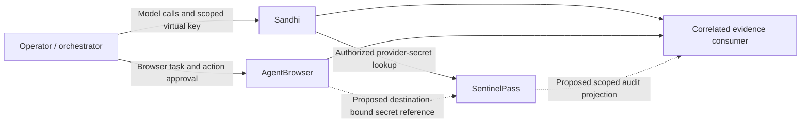

# Browser, gateway and vault co-design

Status: Proposed cross-repository design; AB01 synthetic Sandhi smoke verified.
Date: 2026-09-04
Tracking: [TD-0026](../td/TD-0026-gateway-product-evolution.md).

## Work backward from the operator outcome

An operator should be able to authorize an agent task, understand its model usage and browser
actions, stop further activity, and investigate failure without giving the agent a vault dump
or losing track of partially completed work. Browser automation must remain useful without an
LLM; a gateway must remain useful without a browser; a vault must not require either service.

Co-design the boundaries and conformance tests, not a merged runtime or shared credential store.
The orchestrator coordinates the task and human approvals; it is not a new authority over the
other products. Each component must enforce its own authorization independently.

| Component | Owns | Must not absorb |
|---|---|---|
| Sandhi | Model-call admission, provider transport, neutral usage, budget policy and model-call evidence | Browser execution, vault unlock, downstream price authority |
| SentinelPass | Secret custody, authorized field access, grants, lock/rotation/revocation lifecycle | Model routing, browser action approval, unrestricted telemetry ingestion |
| AgentBrowser | Browser sessions, semantic targets, action execution, egress enforcement, action outcomes and sensitive artifacts | Provider keys, gateway-wide admin authority, price calculation, autonomous vault unlock |
| Orchestrator / operator | Task intent, human approval, correlation and downstream cost interpretation | Bypassing a denial from any component |

Solid arrows describe component roles, not certification of an end-to-end production deployment.
Dashed arrows require new cross-repository contracts. Browser traffic does not pass through
Sandhi; the orchestrator's model traffic does. AgentBrowser's deterministic service has no need
to call a model merely to execute a browser action.

## Evidence and current gaps

AgentBrowser source inspected in `../agentbrowser` at
`dec28b3882eb2da9cbe2dbefa571efbbbb951292` (clean tracked worktree at inspection).
The local compiled packages were initially stale: `getSnapshot` was absent at runtime despite
being present in source. Missing workspace dependency links also required a frozen-lockfile
offline install before the full package build passed; no tracked sibling files changed.
A rebuilt source checkout is required for the smoke below. Build output
is not proof of source revision; joint CI should build pinned clean checkouts and retain hashes.

| Source in AgentBrowser | Observed capability / limitation |
|---|---|
| `packages/api/src/service.ts`, `getSnapshot`, `executePlan` | Semantic fields and revision-scoped refs; bounded stale-target remapping, with stronger role/label matching in verified mode. No assurance that arbitrary page intent is understood. |
| `packages/api/src/server.ts` | Bearer-key tenant ownership when configured; unauthenticated local mode otherwise. Server options do not expose the service's secret-manager or network-policy injection seams. |
| `packages/core/src/secret-manager.ts` | `vault://` references resolve just before use; registered values are redacted. Registry is an in-memory map, not an external broker connector; an empty registry redacts nothing. |
| `packages/api/src/service.ts`, `HIGH_RISK_EFFECTS` | Approval gates for transaction, account-security, external-message and destructive classifications. Classification is not equivalent to comprehensive authorization. |
| `packages/api/src/service.ts`, screenshot handling | Warns that requested pixel masking is not implemented. Screenshots/PDFs/cookies are sensitive, even when textual observations are redacted. |
| `packages/policy/src/network-policy.ts`, `packages/engine-playwright/src/index.ts` | Service plus engine egress enforcement. Production defaults block loopback/private/metadata; session allowlists cannot relax the base. Test access to loopback needs explicit injected policy. |
| `docs/threat-model.md` | Page content is untrusted; experimental engine limitations are explicit. Do not promise equivalent enforcement for every engine. |

SentinelPass evidence and pinned source links remain in the
[gateway–vault design](sentinelpass-gateway-codesign.md). Its sibling checkout was unavailable;
no live SentinelPass daemon or desktop UI was tested. A Tauri desktop UI is not automatically a
web page that AgentBrowser can drive. Identify a supported web/extension harness before adding
browser tests there; use IPC contract fixtures for daemon authorization in the meantime.

The 2026-09-07 UTC [acceptance evidence follow-up](../product/evidence/m1-decisions-2026-09-07/README.md)
adds 18 existing SentinelPass IPC/grant tests from a clean disposable pinned checkout, including
real Unix-socket authorization, client-token rotation/revocation and locked-state cases. It does not start a
live Sandhi–broker integration or close AB02. Restored Sandhi evidence now compares AgentBrowser's
accessibility-visible attribution/budget rows, with negative hidden/misassociated table checks.
Overview card comparisons are DOM-value/label checks only: the current sibling accessibility
observation omits their static text, so it cannot establish their visibility.

## Joint journeys and acceptance

| Journey | UX / contract | Acceptance and failure behavior |
|---|---|---|
| Observe gateway health and usage | Accessible labels, explicit auth/freshness/error states; scoped read identity in a future management API | Browser sees seeded usage after auth; locked/unavailable never look like zero spend; clearing auth removes privileged data |
| Fill an authorized credential | Agent submits opaque reference; broker authorizes client, tenant, destination origin, field, session and action at execution time | Wrong origin/port, redirect, grant expiry, locked vault, missing field or ambiguous target deny before fill; no silent plaintext fallback |
| Explain a task's cost and progress | Join browser action evidence to model-call attempts using opaque correlation IDs | Show physical model attempts, action outcomes and uncertain/partial completion separately; never count a browser action as model tokens |
| Revoke or stop | Explicit scope: stop new model dispatch, stop browser actions, or revoke credential access | Each subsystem acknowledges its own cutoff; in-flight requests, existing authenticated cookies and completed side effects are reported, not claimed undone |
| Recover after failure | Preserve completed action prefix and uncertain result; ask for fresh intent where needed | Do not retry payments, messages or destructive actions merely because a model call or connection was retried |

## Proposed integration contracts

1. **Secret resolver.** Add an async broker adapter behind AgentBrowser's resolver seam, with
   bounded queue/deadline and typed denial/locked/expired/unavailable outcomes. A string prefix
   is not authorization. Bind resolution to authenticated client/tenant, opaque credential and
   field, canonical scheme/host/port, session/page, action fingerprint and grant generation.
   Revalidate destination and target immediately before filling; redirects/new tabs require a
   new decision. Broker support for these bindings must be reviewed, not assumed from today's
   domain grants. No access to a real vault in automated smoke tests.
2. **Secret lifecycle.** Register resolved values for redaction before any service output; bound
   retention and invalidate resolver caches on expiry/revoke. Clearing the secret registry must
   not let old secret-bearing histories or error buffers become visible. Disable artifacts for
   credential workflows until masking/export controls are proven. No raw secret in argv, URLs,
   prompts, spans or task evidence; avoid bulk cookie import/export as a credential workaround.
3. **Evidence envelope.** Propose versioned `run_id`, `step_id`, `attempt_id`, component event ID,
   parent event ID, browser session/page/revision/action ID, opaque credential generation,
   policy revision, outcome, timestamp and freshness. Mark caller-provided correlation as
   unverified; authenticated tenant/subject remain component-authoritative. Minimize URLs and
   page text, use retention/access controls, and deduplicate by component event ID. Never
   infer tenant access from a matching run ID. This is not a shipped shared schema.
4. **Policy and budgets.** Intersect gateway admission, browser egress/action approval and broker
   grants; denial by one is final for that operation. Separate token budgets from action/time/
   download quotas. Downstream pricing may join neutral evidence; no fabricated dollar amounts
   or token-equivalent browser actions. Model retries must not replay completed browser effects.
5. **Capability negotiation.** Report engine enforcement, broker read/write/delete support,
   protocol version, credential generation support, artifact protection and observation freshness.
   Missing capabilities fail closed for workflows that require them. REST wiring, authenticated
   broker injection and scoped read-only Sandhi identities are deliverables, not current claims.

The same-user native broker trust boundary and the new metadata-grant ADR requirement from the
gateway–vault design still apply. OS process compromise is not solved by opaque references.

W04 follow-up (2026-09-05): Sandhi now provides bounded native broker execution, local capability
reporting, typed safe failures and read-only credential reference registration. Its fake-daemon
and browser tests provide a boundary-test pattern for AB03; they do not implement AgentBrowser's
destination/action-bound resolver or prove live broker grants. No browser grant is widened by
Sandhi reference registration. See the [Sandhi broker contract](../product/broker-integration-contract.md).

## Delivery tracker

| ID | Owner / dependency | Deliverable and gate | State |
|---|---|---|---|
| AB01 | Sandhi; W01 | Opt-in real AgentBrowser/Chromium smoke of served dashboard, synthetic secret reference, fresh refs, read/clear and denied non-fixture egress; passed 2026-09-04 against rebuilt `dec28b388` | Complete |
| AB02 | AgentBrowser + Sandhi; AB01/W07 | Review REST injection/capability API and scoped read-only gateway identity; pin clean builds in joint CI; auth/tenant isolation, redirect and artifact-negative tests | Pending |
| AB03 | AgentBrowser + SentinelPass; W04/W09/SP2 | Destination/action-bound resolver contract, bounded IPC, locked/expired/revoked tests; threat review on both sides before enabling real secrets | Pending |
| AB04 | All three + evidence consumer; W05/W10/W13 | Versioned correlation projection, scope/retention/redaction, physical-attempt reconciliation, failure/cancellation drill | Pending |
| AB05 | SentinelPass + AgentBrowser; supported UI harness | Disposable vault onboarding/grant/revoke UI smoke plus native IPC assertions; no real user profile or unlock automation | Pending |

AB01 uses AgentBrowser's in-process service and real engine, not its REST authentication boundary,
and does not validate a SentinelPass connector. Direct Playwright regressions remain the broad
UI/fault suite; AgentBrowser smoke adds consumer-interface coverage rather than replacing it.
See [test instructions](../../tests/sdk-conformance/README.md). No sibling source changes or
external issues/PRs are implied by this proposal; joint owner review is the next contract gate.
