# Sandhi and SentinelPass: credential lifecycle co-design

Status: Proposed joint design, 2026-09-04; no SentinelPass changes or joint sign-off implied.
Sandhi W04 follow-up: native boundary and read-only onboarding implemented on 2026-09-05;
see the [integration contract](../product/broker-integration-contract.md) for verification and limits.
Tracker: [TD-0026](../td/TD-0026-gateway-product-evolution.md).
Sandhi source baseline: `ed1781e`.
SentinelPass source baseline: `00d1e7de09e3d360954240be7588dd7c73ac317e` on `main`.

The requested `../sentinelpass` checkout was absent. This review used the public repository at the
fixed revision below and Sandhi's local adapter. It did not modify SentinelPass, inspect live
vaults, connect to a daemon, or validate unreleased local changes.

## Shared outcome

An operator can provision a provider credential once, grant only the gateway access it needs,
know which applications depend on it, rotate it without distributing secrets to callers, and
verify when revocation has taken effect. Both products gain useful evidence without sharing their
security-critical internals or duplicating a store of secrets.

Sandhi owns AI access, request admission, provider transport and measured usage. SentinelPass owns
encrypted custody, secret grants and credential posture. Each stays independently usable: Sandhi
retains its keyring backend; SentinelPass remains a local-first credential manager. Enterprise
identity and financial policy remain connected-control-plane responsibilities.

## Verified current boundary

| Area | Evidence at the reviewed revision | Implication |
|---|---|---|
| Existing adapter | Sandhi `crates/sandhi-store/src/vault.rs` has optional native `sentinelpass-protocol` IPC and an explicit CLI compatibility path; the manifest requests 0.8.1 | Extend this narrow contract; do not link the vault/crypto core into Sandhi |
| Addressing | `SentinelPassIpcVault::domain` uses `sandhi:<provider>:<label>` and the `Password` field; the daemon normalizes grant domains | Specify canonical provider/label rules and migrate aliases without broadening grants |
| Authentication | IPC envelope has a daemon token and optional per-client token. Token-enforced clients reject wrong/missing tokens and revoked clients do not revert to legacy access | Production setup should require a token-enforced client; `Origin::Cli` is provenance, not identity |
| Authorization | External grants match client/domain/field after normalization, can expire, and require `allow_write` for save | Use read-only runtime grants and separately scoped provisioning authority |
| Delete | The daemon still rejects external `DeleteSecret`; registry ownership metadata has landed but does not itself authorize deletion | Disable/delete affordances according to capabilities; offboarding is grant/key revoke, not deleting arbitrary vault entries |
| Lock | Locked lookup has a distinct response; secret resolution must report locked versus denied versus missing | Keep those states visible; do not automatically unlock a person's vault for a gateway request |
| Registry | Accepted ADR-001 covers logical entities, typed metadata, lifecycle and encrypted secret-equality indexing; external aggregate/posture IPC is deferred | Reuse posture concepts, but never assume an existing grant permits registry enumeration |
| Audit | Daemon external lookup/write paths record audit events; logger initialization can fail and leave auditing unavailable | Existing audit is useful evidence, not proof of lossless or tamper-proof recording |
| Gateway caching | Sandhi builds and caches provider handles from resolved secrets; adapter lacks credential version/expiry/invalidation semantics | Broker revocation affects future lookups, not already cached upstream credentials |
| Runtime integration | IPC adapter bridges a sync trait using its own Tokio runtime; async admin handlers call vault methods directly | Add daemon-backed integration tests and a bounded async-safe bridge before lifecycle expansion |

The daemon's documented trust domain is one OS user. Per-client tokens constrain scopes but do
not provide strong isolation from a malicious process running as that same OS user. Separate OS
identities or a different broker deployment design are needed before making multi-tenant isolation
claims. A same-user IPC token is not a fleet identity credential.

## Reciprocal capabilities

| ID | Direction | User benefit | Proposed shared boundary | Constraint / acceptance |
|---|---|---|---|---|
| S01 | SentinelPass → Sandhi | Provision without copying provider secrets through the dashboard | Reference existing credential and validate exact read grant; capability/status response with stable error codes | Runtime client cannot create grants, enumerate vault entries or write secrets; explicit CLI fallback remains distinguishable |
| S02 | SentinelPass → Sandhi | Rotate and revoke with predictable service behavior | Opaque credential ID, generation, grant revision, validity and invalidation/revalidation | New dispatch stops by a declared deadline; no indefinite stale credential when the daemon is unavailable |
| S03 | SentinelPass → Sandhi | See expiry/rotation posture alongside model health | New scoped metadata grant and a minimal posture projection | No equality tags, cluster sizes, other domains or ungranted entity membership; requires the separate grant-class ADR called for by SentinelPass ADR-001 |
| S04 | Sandhi → SentinelPass | Understand which applications a rotation affects | Authenticated, opt-in consumer-usage summary keyed by opaque credential reference and gateway identity | Metadata only: time range, freshness, caller-approved consumer refs, usage/last successful dispatch; no prompts, keys or unnecessary person identifiers |
| S05 | Both directions | Investigate a denied lookup or failed rotation across products | Shared correlation ID, credential/grant revisions and bounded lifecycle outcome codes | Neither app gains access to the other's full audit log; audit gaps and clock differences remain visible |
| S06 | Sandhi → SentinelPass | Optional governed AI assistance for credential documentation | Any future AI client in the credential-manager UI uses Sandhi virtual keys and bounded requests | Experimental and opt-in only; no master password, secret value, equality index or decrypted vault content goes to a model; do not add a model dependency to unlock, grants or crypto |

S01/S02 are the first integration deliveries. S03/S04 form a subsequent posture/usefulness slice.
S05 supports both. S06 is deferred pending a specific user need; secure deterministic lifecycle
features deliver value without AI assistance.

## Proposed contract, not an existing API

Extend `sentinelpass-protocol` through a versioned capability negotiation. Old daemon/new client
and new daemon/old client must fail or downgrade explicitly; unsupported generation semantics
must not look like fresh authorization. Keep current message shapes compatible where possible.

Candidate logical records, to be finalized jointly:

- `BrokerCapabilities`: protocol revision, supported read/write/status/lifecycle operations,
  token enforcement and supported metadata grant classes. No global registry listing.
- `CredentialReference`: opaque credential ID plus canonical domain/field, scoped to a verified
  gateway client. Do not derive it from the secret or return a secret hash as its identifier.
- `CredentialLease`: authorized secret material in a zeroizing wrapper, generation, grant revision,
  `issued_at`, `valid_until` and allowed use. This bounds gateway reuse; it cannot invalidate a
  provider's API key by itself. Introduce it only with daemon enforcement and expiry tests.
- `CredentialStatus`: allowed metadata such as available/locked/denied/expired, expiry and rotation
  posture; it must reveal no additional credential existence to unauthorized callers.
- `CredentialLifecycleEvent`: opaque reference, monotonic generation/revision, event type and event
  ID. Pull-by-cursor with periodic revalidation is a viable first implementation; streaming push
  is an optimization. Detect missed events and restart from an authorized snapshot.
- `ConsumerUsageSummary`: gateway identity, credential reference, observation window, freshness and
  complete/partial status, successful-use timestamp and authorized consumer count/references.
  Gateway submits are observations, never authority to create/revoke grants or alter secrets.

Do not serialize secret-bearing types with `Debug` output or persist them in Sandhi's SQLite
metadata, usage events or audit. Minimize copies through provider builders; zeroization reduces
residual lifetime but does not prove a compromised running process cannot read active credentials.

The current adapter joins provider/label strings while the broker normalizes domains. Resolve
case, separator, whitespace and trailing-dot behavior once; test collisions and reject ambiguous
new identifiers. Retain explicit old-to-new aliases during migration with an exact grant for each
approved target. Never silently convert exact grants to wildcards.

## Lifecycle and failure semantics

```mermaid
stateDiagram-v2
    [*] --> Unresolved
    Unresolved --> Active: authorized resolution and generation
    Unresolved --> Unavailable: locked, missing or denied
    Active --> Staging: replacement provisioned
    Staging --> Active: verification fails; valid old generation retained
    Staging --> Draining: replacement verified and activated
    Draining --> Active: old in-flight work finalized
    Active --> Revoked: grant revoked or validity expires
    Draining --> Revoked: emergency revoke
    Revoked --> Unresolved: explicit new authorization
    Unavailable --> Unresolved: operator recovery
```

Normal rotation: stage a replacement in SentinelPass; validate it with a declared non-billable
check where available, or an explicitly approved bounded test call; build a new provider handle;
atomically switch new dispatches; drain old in-flight requests; release old secret references;
record observed activation. A secret changing in the vault does not prove provider-side rotation
completed. Distinguish provider-managed key issuance from merely storing a replacement.

Emergency revoke: block new gateway dispatch and invalidate its cached generation first; cancel
active work if the selected incident policy requires it; finalize partial/unknown usage; revoke
the broker grant and arrange provider-key revocation through a provider-supported workflow. These
are separate operations with independent acknowledgements. Never report upstream revocation merely
because the broker grant disappeared.

Proposed initial revalidation target: stop new use within 60 seconds of a revocation, bounded by
the smaller of configured revalidation interval and lease expiry; verify under load before adoption.
An offline broker permits continued use only until the already-issued validity bound under an
explicit policy. Expiry or lost authorization fails closed for new dispatch. Routine vault lock
requires a documented choice about still-valid leases; interactive auto-lock and unattended servers
have different needs and must not silently disable one another's security posture.

Failure matrix:

| Failure | Gateway behavior | Broker/control behavior |
|---|---|---|
| Locked / grant denied / not found | Distinct operator state; safe provider-unavailable error to clients; no secret echoed | Do not unlock or mint a grant on behalf of the request |
| Missing client token or IPC feature | Production validation fails with remedy; development compatibility mode is explicit | Preserve strict client-token semantics; no tokenless fallback for a token-enforced client |
| IPC hangs or disconnects | Bounded timeout and queue; continue only under unexpired authorization; no async-worker blocking | Contract exposes retryability; no retry of ambiguous writes without idempotency |
| Rotation validation fails | Keep valid old generation; show staged failure; do not broaden permissions | Preserve staged credential and explicit cleanup ownership |
| Invalidation missed / process restarts | Resume cursor or revalidate before using persisted metadata; never persist plaintext credential cache | Revisions and expiry prevent replaying obsolete authorization |
| Audit or summary delivery fails | Show incomplete evidence and bounded backlog; incident workflow cannot infer unused credential from silence | Retain scoped records with documented durability; no automatic revoke based only on missing usage |

## Co-drive delivery plan

| Slice | Sandhi work | SentinelPass work | Gate / status |
|---|---|---|---|
| SP0: boundary baseline | Pin adapter/source evidence; reproduce native admin-call behavior with fake daemon | Verify supported daemon/protocol versions and security status | Sandhi fake-handler/runtime/queue tests implemented; real broker/version/security certification pending |
| SP1: safe onboarding | Async-safe bounded vault operations, backend capabilities, reference registration, actionable setup states | Capability/status response and token-enforced setup path if needed | Sandhi implementation and synthetic grant/browser tests complete; daemon negotiation and joint review pending. Local capabilities are not grant assertions |
| SP2: lifecycle | Credential manager generations, revalidation, activation/drain, invalidate and telemetry | Version/expiry and scoped lifecycle contract; separate provider rotation status | Pending after SP1; revocation/expiry race and process-restart tests |
| SP3: posture and usage | Scoped posture view and durable summarized usage export | Grant-class ADR, minimal posture projection and authenticated observation ingestion | Pending after SP2; cross-domain information-flow tests |
| SP4: joint release | Minimum/latest protocol matrix, mock and real-daemon test job, operator runbook | Compatible daemon release and migration/recovery guide | Pending; Unix and Windows CI, old/new version matrix, zero secret leakage |

Each slice needs a paired review from gateway and broker owners, plus a security reviewer for
new grants or secret lifetime changes. Owner roles are proposals, not assignments to people.
Publish the protocol change before consuming it, pin supported versions, and update release
feature builds and `.github/workflows/update-protocol-pin.yml` compatibility gates. No remote
issue, message, PR or release is created by this planning activity.

Joint tests must include exact/cross-domain authorization, grant and client-token expiry/revoke,
legacy rejection, locked startup, missing secret, refused deletion, read-only/write grant separation,
credential refresh under load, pending stream drain, missed invalidations, clock skew, process
restart, stale generation replay, IPC timeout, audit loss and secret redaction. Add namespace
normalization/collision cases. Testing only serialization or compiling the optional feature does
not satisfy these gates.

## Browser execution extension

The [three-way co-design](browser-gateway-vault-codesign.md) adds AgentBrowser as a consumer of
destination/action-bound secret references and a producer of browser-action evidence. This
does not expand existing broker grants implicitly: origin/field/session binding, generation
revalidation and artifact controls require joint contract review. Sandhi model budgets do not
authorize browser side effects. AB01 validates a synthetic gateway UI journey; AB03/AB05 track
the unimplemented broker adapter and supported disposable-vault UI harness.

## Source references

All links below are pinned to the reviewed SentinelPass revision:

- [Security architecture and secrets-broker trust model](https://github.com/anvai-labs/sentinelpass/blob/00d1e7de09e3d360954240be7588dd7c73ac317e/SECURITY_ARCHITECTURE.md).
- [External grants, token verification and normalization](https://github.com/anvai-labs/sentinelpass/blob/00d1e7de09e3d360954240be7588dd7c73ac317e/sentinelpass-core/src/external_secret_access.rs).
- [Daemon authorization, external write/delete and audit behavior](https://github.com/anvai-labs/sentinelpass/blob/00d1e7de09e3d360954240be7588dd7c73ac317e/sentinelpass-core/src/daemon/ipc/server.rs).
- [Credential registry ADR and external metadata grant constraint](https://github.com/anvai-labs/sentinelpass/blob/00d1e7de09e3d360954240be7588dd7c73ac317e/docs/decisions/adr/ADR-001-credential-registry-by-logical-entity.md).
